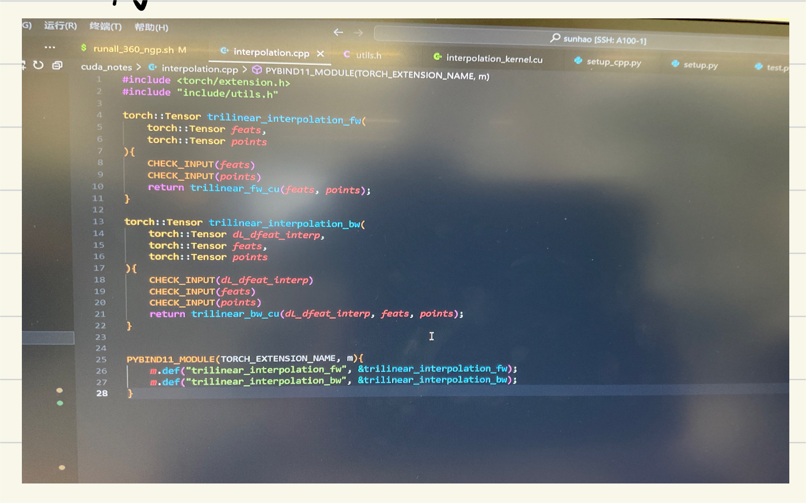
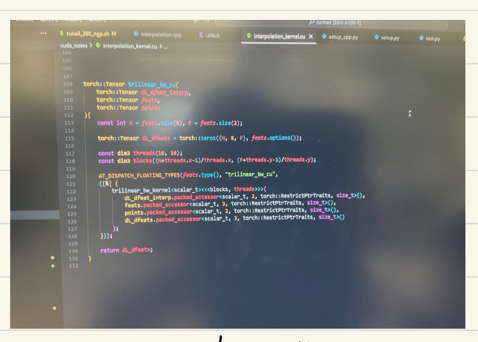

# Cuda 编程样例实验（以三线性插值为例）
## 任务描述
- 本任务旨在通过在python代码中嵌入cuda编程来对三线性插值进行加速优化
- 本任务主要分为两步：正向求解、反向传播。主要是为了模拟神经网络的训练过程，这里采用了正向求解结果模拟反向传播的梯度。

## 代码框架
```
- include
--- utils.h
- interpolation_kernel.cu
- interpolation.cpp
- setup.py
- test.py
```
其中，setp.py中包含cuda函数的注册，interpolation.cpp中的函数则是连接cuda函数和python包的枢纽，interpolation_kernel.cu中包含cuda函数的具体实现，include/utils包含了cuda函数的定义。最后，test.py函数是具体的测试样例，其中调用了相应的基于cuda实现的函数和基于pytorch实现的函数， 进行了具体的速度比对。

## 代码
- setup.py<br>
该代码起到的作用主要是对cuda编写的函数进行打包并命名，经过编译后就可以直接作为一个python库进行import，然后能和其他python库被调用。这里我们可以看到，这里我们打包后的库名为cppcuda_tutorial，编译后我们就能通过import cppcuda_tutorial 访问该库中编译好的各个函数。


- include/utils
这个代码主要起到的作用是对cppcuda_tutorial库中的各个函数进行声明定义，这里定义了前向过程和反向过程的两个函数以及一些cuda参数的验证函数。

- interpolation.cpp
该c++代码的主要作用是作为python代码和cuda代码之间的桥梁纽带，将python代码中的输入经过检验后传入cuda函数，然后将cuda函数的返回值再传回python代码。这里要注意的是需要在该代码中对c++函数进行模块注册，注册后的命名即为cppcuda_tutorial的module的命名。


- interpolation_kernel.cu <br>
该代码中主要包含两个部分：前向过程以及反向过程，这两个过程又各自包含两个函数（主函数：负责treads和block的计算；核函数：负责每个cuda核的计算过程）
    1. 前向过程<br>
        1. trilinear_fw_cu<br>
            <br>
        2. trilinear_fw_kernel<br>
            <br>

    2. 反向过程<br>
        1. trilinear_bw_cu<br>
            <br>
        2. trilinear_bw_kernel<br>
            <br>
- test.py


## 测试结果

