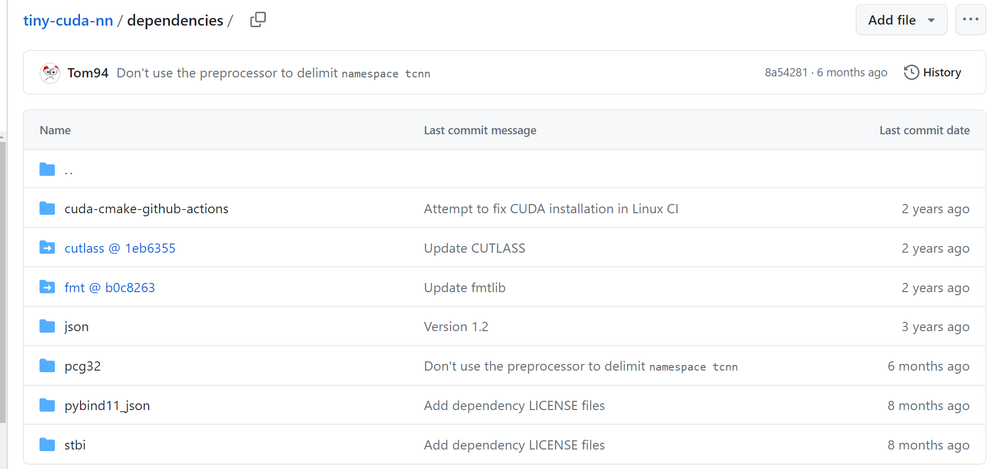
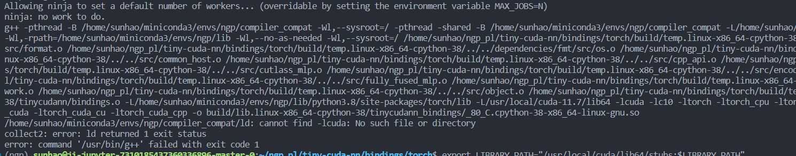
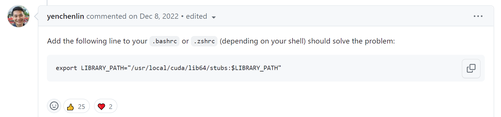

# The environment
* GUP: A100 
* ubuntu: 20.04
* CUDA: 11.7
* Pytorch: 1.13.0+cu117 (torchvision, torchaudio are coresponding to the version on the official website)
* python: 3.8.18
* cmake: 3.21.0 (>=3.21.0)
* gcc: 9.4.0(>=8.0.0)

# tiny-cuda-nn installation
* Install the following packages: 
`sudo apt-get install build-essential git`

* Adding the CUDA installation to your PATH. For example, if you have CUDA 11.7, add the following to your ~/.bashrc. 
`export PATH="/usr/local/cuda-11.7/bin:$PATH"` 
`export LD_LIBRARY_PATH="/usr/local/cuda-11.7/lib64:$LD_LIBRARY_PATH"`

* Clone this repository and all its submodules using the following command ***(easy to fail && slow)***: 
`git clone --recursive https://github.com/nvlabs/tiny-cuda-nn` 
beacuse there are two link  in tiny-cuda-nn/dependencies

* So there is a replace way(Work): 
`git clone https://github.com/nvlabs/tiny-cuda-nn` 
or `git clone https://gitee.com/xubin1994/tiny-cuda-nn.git`***(Faster)*** 
`cd tiny-cuda-nn/dependencies` 
`git clone https://gitee.com/qijunniu/fmt.git` 
`git clone https://gitee.com/git_mirror/cutlass.git`

* Move to ./tiny-cuda-nn. Then, use CMake to build the project:  
`tiny-cuda-nn$ cmake . -B build -DCMAKE_BUILD_TYPE=RelWithDebInfo` 
`tiny-cuda-nn$ cmake --build build --config RelWithDebInfo -j`

* Then, 
`tiny-cuda-nn$ cd bindings/torch` 
`tiny-cuda-nn/bindings/torch$ python setup.py install`

# Problem List
* P1: cannot find -lcuda: No such file or directory(in the step "python setup.py install")

* solution: https://github.com/NVlabs/tiny-cuda-nn/issues/183

