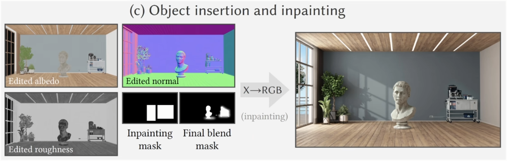
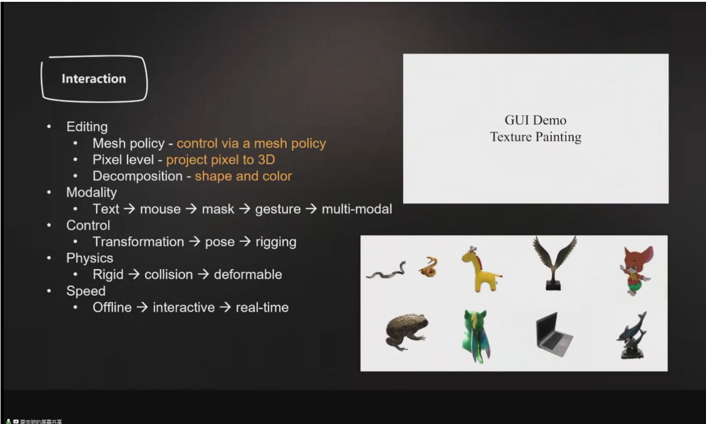

# Games 直播课 317 notes
## 内容一：RGB ↔X：基于材质与关照的图像生成扩散模型
- 主讲人：闫令琪
- 传统渲染和Diffusion生成的对比：
	- 传统渲染：更加精确、真实、但需要描述整个场景
	- Diffusion生成：直接通过prompt控制，更加便捷、生成较真实、但很难达成精确的控制
- 难点：如何干净的、彻底的分解出不同的解耦图？解耦过程中存在很多的不确定性
- idea：基于Diffusion从RGB中解耦出X，对不同解耦成分进行控制，增强生成的可控性

- 过程&&结果
	- RGB->X
	
	- X->RGB（可以选择性的输入X去生成不同预期的结果）
	
- 结果
	- RGB->X
	
	- X->RGB
	
- 应用
	- 通过prompt来替代X，进行解耦成分的语义控制，如下左图所示，输入的X只有法线图和Albedo图，而光照则通过prompt进行语义输入。再如下右图所示，输入的X只有法线图和光照图，而沙发的材质通过prompt进行语义输入。
	
	- 通过对解耦图X进行编辑（插入），配合mask图实现渲染结果中也达到预期的效果
	
## 内容二：AI时代的图形流水线探讨
- 主讲人：霍宇驰
- 传统Graphics Pipeline研究内容：
物理世界 -> 建模 ->数字空间 -> 渲染 -> 渲染图

- Graphics Pipeline 研究内容：
重建、生成、交互、渲染、计算

- AI时代重建方面的变化：

- AI时代生成方面的变化：
 

- AI时代交互方面的变化：如何控制新式的图元
- 

- AI时代渲染方面的变化：

 - AI 改变图像管线的一些效果展示
 - SORA和传统图形管线的对比分析

## 内容三：多模态视频理解基础模型
- 主讲人：王利民
- 视频理解：
	- 层次：基础运动的感知（底层的动作、信息），更大、更长的视频感知（秒级、分钟级、小时级）
	- 基本核心模块：通用的视频编码器和任务解码器（用于多任务）
	
- 视频通用大模型：书生2.0（InternVideo）
	- 提出了一种渐进式预训练范式、逐步对其多粒度语义，形成多任务处理能力
	- 在Scaling Law的引导下扩大训练数据和模型规模

- 视频理解模型的三个阶段：单模态理解任务；多模态理解任务；生成任务
- 一阶段：视频掩码自编码器VideoMAE、VidoeMAE V2（双重掩码）
	-	采用高掩码策略提高任务难度，自监督的加强训练的效果，并加快训练时间
- 二阶段： 支持多单模态和多模态任务（UMT）
	- 使用了UnmakeTeacher策略、掩码策略
- 三阶段：时序理解的视频对话系统（VideoChat2） 
 
 

- 成果方面
	- 视频数据与基准：大规模的数据集InterVid —用于视频的生成任务与理解任务  （ICLR 2024）
	- 视频理解模型的评测基准： MVBench
	- 视频多模态理解模型：VideoChat2 （ CVPR 2024）
	- 视频生成模型：BIVDiff （cvpr 2024）

## 内容四：融合数据驱动和物理法则的三维视觉内容生成
- 主讲人：王申龙

- 核心思想：如何使计算机获得像人类一样拥有感知物理世界并且进行想象的能力，从而使得模型能够进行可信的三维世界内容的创造。

- 问题分析：过去几年三维计算机视觉的发展让我们有能力通过神经网络、3D GS对真实世界非常精确地进行建模和理解，通过数字模型对真实世界进行还原，但是还原只能对已存在的内容进行还原，进行再创作的能力比较局限。 
- 终极目标：连接数字世界和真实世界
- 两部分具体内容：光照仿真、动态仿真
- 光照
	- 任务：解耦光照、改变光照

	- 核心挑战和目标
	单一光照、单一视频的数据 -> 大规模场景的relighting
	
	- 方式：
		- 数据驱动、数据先验/理解
		- 额外约束，显式建模：如阴影（shadow）
- 动态
	- 风格转换：转换为冬天风格（存在的问题：物体上并无积雪）
	
	- 风格转换+物理仿真：精确控制下雪量、积雪量（具体方式未提）——结果更加逼真
- 应用：视频 -> 游戏 Vidoe2Game （CVPR 2024）

通过nerf建模，转mesh，语义理解，语义分割，通过一些仿真方式去计算一些游戏引擎所需要的参数（如物体与物体之间的摩擦等），构建3D assets。

